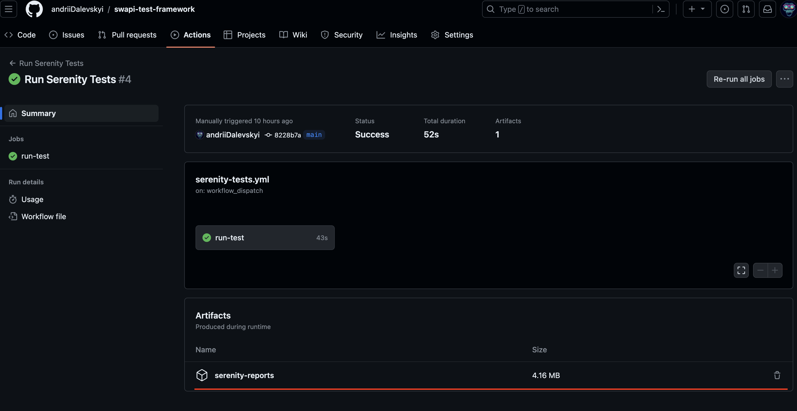
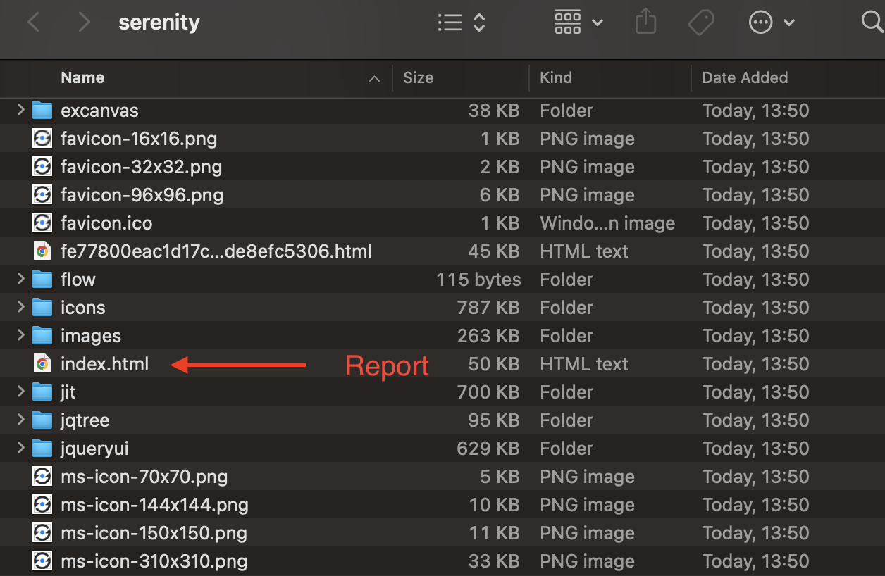
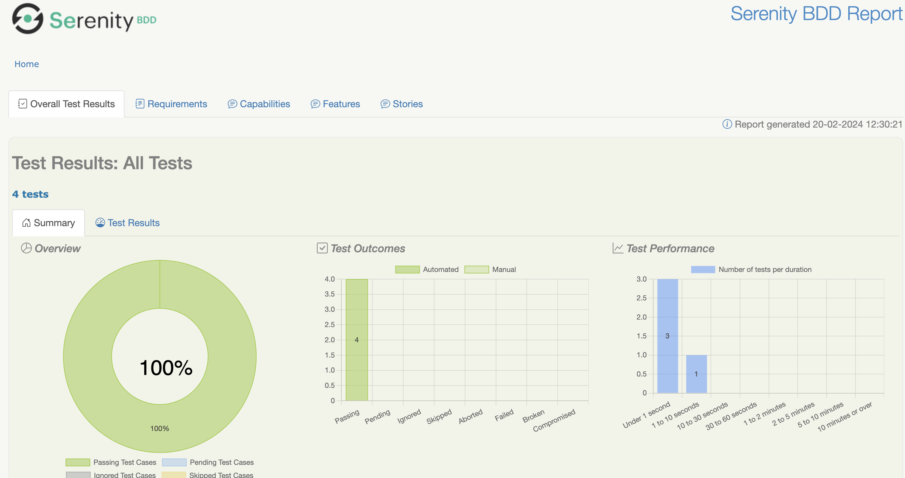

# swapi-test-framework

This is a demo framework for testing `https://swapi.dev/` API.

## How to run tests

- Use for it GitHub Actions -> run-test -> Run Workflow
- After the test run is finished you can download the report from the job artifacts

  
